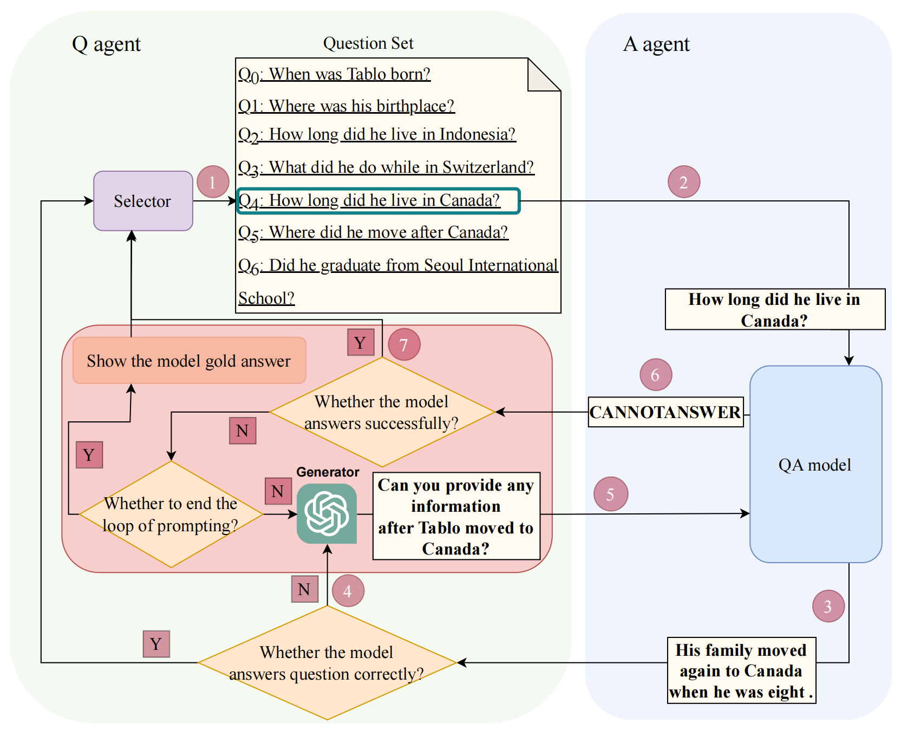

# Interview Evaluation: A Novel Approach for Automatic Evaluation of Conversational Question Answering Models
This is the repository for our EMNLP'2023 paper [Interview Evaluation: A Novel Approach for Automatic Evaluation of Conversational Question Answering Models](https://aclanthology.org/2023.emnlp-main.209/). The slides for our ACL presentation can be found [here](https://github.com/cipolee/interview_evaluation/blob/master/EMNLP_presentation_xiboli.pptx).

## Quick links
* [Overview](#Overview)
* [Conversational Question Answering Dataset](##conversational-question-answering-dataset)
* [Automatic model evaluation interface](#Automatic-model-evaluation-interface)
* [Setup](#Setup)
  * [Install dependencies](#Install-dependencies)
  * [Download the datasets](#Download-the-datasets)
* [Evaluating existing models](#Evaluating-existing-models)
  * [BERT](#BERT)
  * [GraphFlow](#GraphFlow)
  * [HAM](#HAM)
  * [ExCorD](#ExCorD)
* [Obtain Metrics](#Obtain-Metricsl)
* [Citation](#Citation)

## Overview

In this work, we propose a novel automatic evaluation approach for CQA models, which has the following advantages:
  1. Avoid labor and dataset costs. Train on the training set and then evaluate on the independent and identically distributed (IID) test set.
  2. Conversation history is based on the model's own predictions, and unresolved coreferences should be avoided. Cannot weaken dialogical properties, such as Auto-Rewrite Evaluation.
  3. Enable interactivity for automatic evaluation of CQA models.



## Conversational Question Answering Dataset

We used two CQA datasets, namely QuAC and CoQA. QuAC was proposed in the paper [QuAC : Question Answering in Context.](https://arxiv.org/pdf/1808.07036.pdf) The json file of QuAC is structured as follows:

```
{"data": 
	[{
     "paragraphs": 
      	[
      		{
      		# The passage used in this conversation.
      		"context": "In May 1983, she married Nikos Karvelas, a composer, ...", 
      			
      		# The conversation, which contains a list of QA pairs.
      		"qas": [
      		{
            "followup": "y", 
            "yesno": "x", 
            "question": "what happened in 1983?", 
            
            # The golden answers list
            "answers": [
              {"text": "In May 1983, she married ...", "answer_start": 0}, 
              {"text": "In May 1983, she married Nikos Karvelas, a composer,", "answer_start": 0}, 
              ...
              ], 
            
            # id of question: # turn id
            "id": "C_5ab583f64dbb47b995cf59328ea0af43_1_q#0", 
            "orig_answer": {
                "text": "In May 1983, she married Nikos Karvelas, a composer,", 
                "answer_start": 0}}
          }
        ...
        ]
      }
    ....
  ]}]
}


```

QuAC was proposed in the paper [CoQA: A Conversational Question Answering Challenge.](CoQA: A Conversational Question Answering Challenge) The json file of CoQA is structured as follows:

```
{
	"version": "1.0", 
	"data": 
		[{
			"source": "mctest", 
			"id": "3dr23u6we5exclen4th8uq9rb42tel", 
			"filename": "mc160.test.41", 
			"story": "Once upon a time, in a barn near a farm house, there lived a ...".", 
			"questions": [
				{"input_text": "What color was Cotton?", "turn_id": 1}, 
				{"input_text": "Where did she live?", "turn_id": 2}, 
				...], 
			"answers": [
				{"span_start": 59, "span_end": 93, "span_text": "a little white kitten named Cotton", "input_text": "white", "turn_id": 1},
        {"span_start": 18, "span_end": 80, "span_text": "in a barn near a farm house, there lived a little white kitten", "input_text": "in a barn", "turn_id": 2}, ]},
        "name": "mc160.test.41"},
        ...
        ]
 }
```

You can visit these two paper in order to download the datasets.

## Setup

### Install dependencies

Please install all dependency packages using the following command:
```bash
pip install -r requirements.txt
```


## Evaluating existing models of QuAC

We provide our implementations for the four models that we used in our paper: BERT, [GraphFlow](https://www.ijcai.org/Proceedings/2020/171), [HAM](https://dl.acm.org/doi/abs/10.1145/3357384.3357905), [ExCorD](https://aclanthology.org/2021.acl-long.478/). We modified exisiting implementation online to use model predictions as conversation history. Below are the instructions to run evaluation script on each of these models. **Moreover, we upload all models in our Google Drives. You could send a share request to get the content in the link**

### BERT
We implemented and trained our own [BERT model](https://drive.google.com/drive/folders/1PoSntNz-7tAeRuD5YsUuXu1feREHKBD7?usp=drive_link).
```bash
# Run Interview Evaluation (use generated history as example)
CUDA_VISIBLE_DEVICES=$ID python3 interview_eval.py \
--type bert \
--output_dir outputs/princeton_nlp \
--write_dir results/pred \
--predict_file data/predict.json \
--qa_log bert.txt \
--history_ground_truth True \
--match_metric f1 \
--add_background \
--skip_entity \
--pred \
--start_i \
--end_i \
--do_lower_case
# --history_ground_truth True \


```


### GraphFlow
We implemented and trained our own [GraphFlow model](https://drive.google.com/drive/folders/1_l2AfFNFjCk2lH2FjT85ykARBuJ8tJSu?usp=drive_link).
```bash

# Run Evaluation (Auto-Rewrite as example)
CUDA_VISIBLE_DEVICES=$ID python3 interview_eval.py \
--type graphflow \
--output_dir outputs/graphflow/ \
--write_dir results/pred \
--predict_file data/dev.json \
--embed_file outputs/graphflow/glove.840B.300d.txt \
--pretrained outputs/graphflow \
--saved_vocab_file data/word_model_min_5 \
--match_metric f1 \
--qa_log graphflow.txt \
--history_ground_truth True \
--add_background \
--skip_entity \
--pred \
--fix_vocab_embed \
--f_qem  \
--f_pos  \
--f_ner  \
--use_ques_marker \
--use_gnn \
--temporal_gnn \
--use_bert \
--use_bert_weight \
--shuffle \
--out_predictions \
--predict_raw_text \
--bert_doc_stride 250 \
--bert_model bert-base-uncased \
--bert_dim 768 \
--start_i ${index_of_first_passage_to_eval} \
--end_i  ${index_of_last_passage_to_eval_exclusive}

#
# --qa_log QA_agent_graphflow.txt \
```


### HAM
The orgininal model checkpoint can be downloaded from [ our Google Drive](https://drive.google.com/drive/folders/1KeZjIFjeQ7bqVh2yAzr8c0xa7kb_iIww?usp=drive_link)

```bash
# Run Evaluation (Auto-Rewrite as example)
CUDA_VISIBLE_DEVICES=$ID python interview_eval.py \
  --type ham \
  --output_dir outputs/ham_checkpoint \
  --write_dir results/pred \
  --predict_file data/predict.json \
  --qa_log ham.txt \
  --history_ground_truth True \
  --max_seq_length 512 \
  --doc_stride 128 \
  --max_query_length 64 \
  --do_lower_case \
  --history_len 6 \
  --match_metric f1 \
  --add_background \
  --skip_entity \
  --pred \
  --init_checkpoint outputs/ham_checkpoint/model_52000.ckpt \
  --bert_config_file bert-large/bert_config.json \
  --vocab_file bert-large/vocab.txt \
  --MTL_mu 0.8 \
  --MTL_lambda 0.1 \
  --mtl_input reduce_mean \
  --max_answer_length 40 \
  --max_considered_history_turns 4 \
  --bert_hidden 1024 \
  --fine_grained_attention \
  --better_hae \
  --MTL \
  --use_history_answer_marker \
--start_i ${index_of_first_passage_to_eval} \
--end_i  ${index_of_last_passage_to_eval_exclusive}
```


### ExCorD
The original model checkpoint can be downloaded from [ our Google Drive](https://drive.google.com/drive/folders/1U2sDsYayAcSjVzMz6yODwSIYgNs-P9rt?usp=drive_link)

```bash
# Run Interview Evaluation (use generated history as example)
CUDA_VISIBLE_DEVICES=$ID python3 interview_eval.py \
--type excord \
--output_dir outputs/excord_korea \
--write_dir results/pred \
--predict_file data/predict.json \
--match_metric f1 \
--qa_log excord.txt \
--history_ground_truth True \
--add_background \
--skip_entity \
--pred \
--start_i ${index_of_first_passage_to_eval} \
--end_i  ${index_of_last_passage_to_eval_exclusive}
```
Evaluating existing models of CoQA is similar as the above.

## Obtain Metrics

```shell
cd post_process_eval_results
python3 post_pocess.py
```


## Citation

```bibtex
@inproceedings{li-etal-2023-interview,
    title = "Interview Evaluation: A Novel Approach for Automatic Evaluation of Conversational Question Answering Models",
    author = "Li, Xibo  and Zou, Bowei  and Fan, Yifan  and Li, Yanling  and Aw, Ai Ti  and Hong, Yu",
    booktitle = "Proceedings of the 2023 Conference on Empirical Methods in Natural Language Processing",
    month = dec,
    year = "2023",
}

```
